# LinPlayer

  
  
  
  
  
  
  
  
  
  
  

  <b>简体中文</b> ·
  <a href="docs/README.en.md">English</a> ·
  <a href="docs/README.ja.md">日本語</a>

**LinPlayer** 是一个 Emby 第三方客户端。目标平台 **Windows / Linux / Android / Android TV**，当前**只有 Windows 可用**。

> ### 🚧 重构中（2026-07）
>
> 项目正在从 **Rust 核心 + React/Tauri** 迁移到 **Go 核心 + 各端原生 UI**。
> 2026-09-04 旧的 Rust/Tauri 栈已从仓库删除。
>
> - **Windows** —— 可用，正常发布。免安装绿色包，数据全在主程序同级的 `userdata/`。
> - **Linux / 安卓 / Android TV** —— **暂无可用版本**：Go 版的这几端 UI 还没写，
>   而旧的 Rust 实现已随本次重构删除。历史版本仍可在 Releases 里找到。

业务能力（Emby 协议 / 网络 / 播放控制 / 同步 / 下载 / 插件）集中在一份**各端共用的 Go 核心层**里，编译成 `lpcore` 动态库；每端只写自己的 UI，按各自的交互语言实现。所以下表中标 🔨 的项目并不是"还没做"，而是**核心已就绪、等 UI 接线**。

## 功能特性

| 功能 | 说明 | 桌面 | 安卓 / TV |
|:--|:--|:--:|:--:|
| **MPV 播放内核** | 全格式；HDR / Dolby Vision（自动切 gpu-next + 软解）；PGS/SUP 图形字幕；Anime4K 超分与画质档位 | ✅ | 🔨 |
| **弹幕** | 弹弹play 等多后端，智能集数匹配、并行分源、描边与显示区域可调 | ✅ | 🔨 |
| **字幕** | 自动加载 Emby 字幕流；轨道切换、延迟、字体/大小/位置；libass 完整特效 | ✅ | 🔨 |
| **播放记录同步** | Emby 进度上报，跨服务器续播 | ✅ | 🔨 |
| **Trakt / Bangumi** | 观看记录 Scrobble 与追番进度同步 | ✅ | 🔨 |
| **追剧日历** | Trakt / Bangumi 放送表 | ✅ | 🔨 |
| **排行榜** | 弹弹play 动漫榜 + TMDB 影视榜（可关） | ✅ | 🔨 |
| **下载** | 自建多线程 Range 分段下载引擎 | ✅ | 🔨 |
| **多线程加载** | 本地预取代理，并发 Range 超前拉流喂播放器 | ✅ | 🔨 |
| **代理** | 自定义代理 + CF 优选 IP 本地反代 | ✅ | 🔨 |
| **插件系统** | QuickJS 脚本引擎，逐插件隔离，崩溃/超时不影响宿主 | ✅ | 🔨 |
| **批量添加服务器** | 粘贴多行配置一次性解析导入 | ✅ | 🔨 |
| **配置迁移** | 扫码在设备间直传服务器配置（含凭据，离线不过云） | ✅ | 🔨 |
| **应用内更新** | 双渠道（stable / pre）覆盖更新 | ✅ | 🔨 |

✅ 已接线可用 · 🔨 核心已就绪，UI 重建中

## 界面预览

### 桌面端

> 截图内容来自 [**UHD MEDIA**](https://www.uhdnow.com)。

<table>
  <tr>
    <td colspan="2"> <b>播放页</b></td>
  </tr>
  <tr>
    <td width="50%">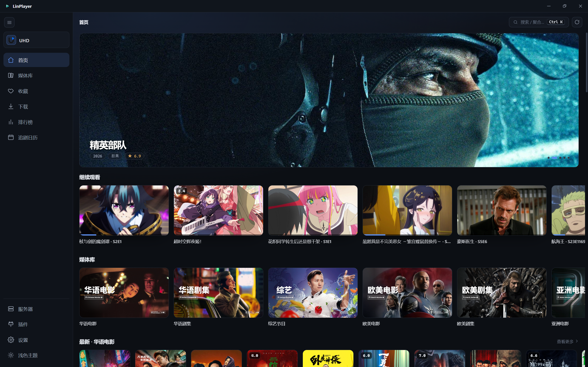 <b>首页</b></td>
    <td width="50%">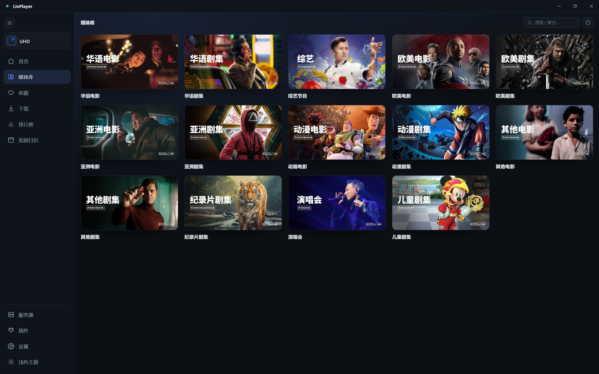 <b>媒体库</b></td>
  </tr>
  <tr>
    <td>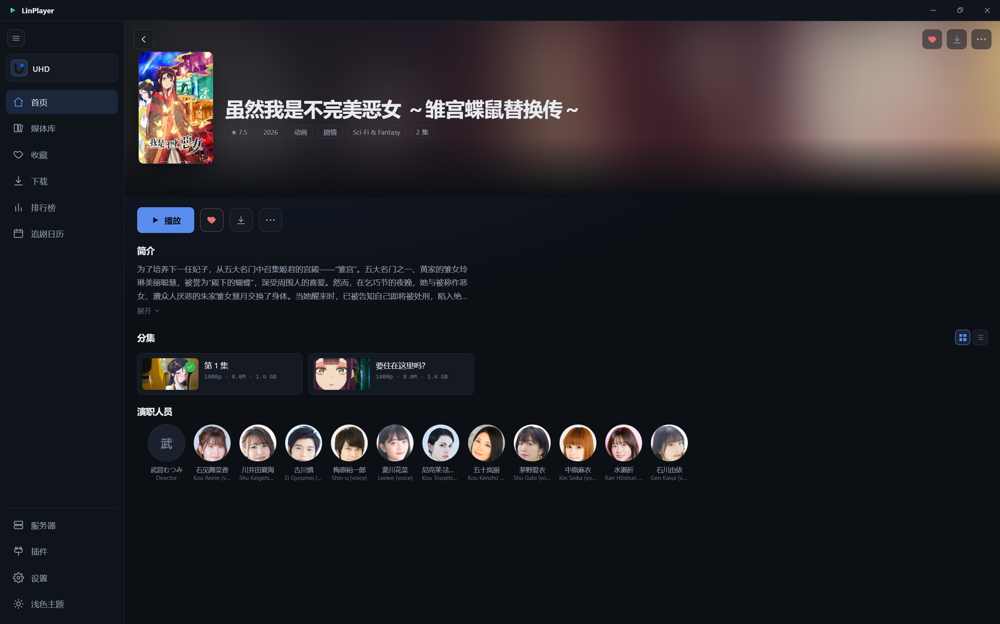 <b>剧集详情</b></td>
    <td>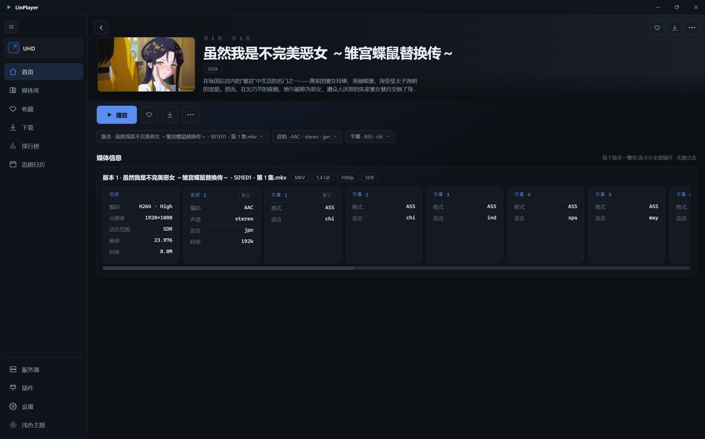 <b>集详情</b></td>
  </tr>
  <tr>
    <td>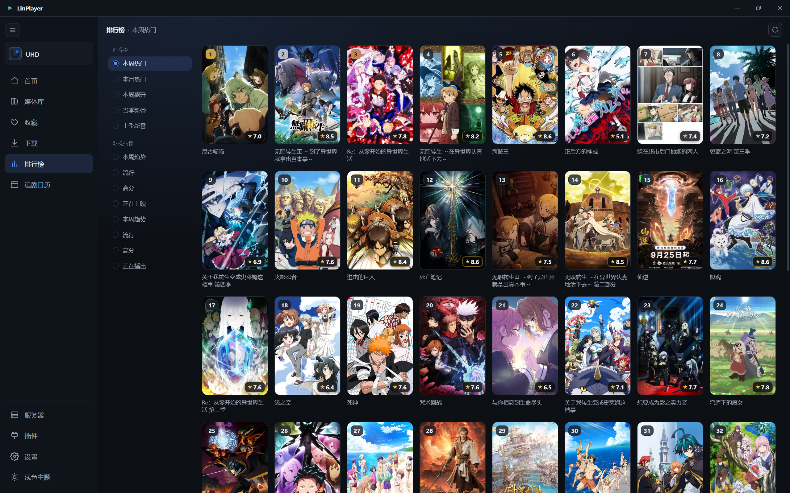 <b>排行榜</b></td>
    <td>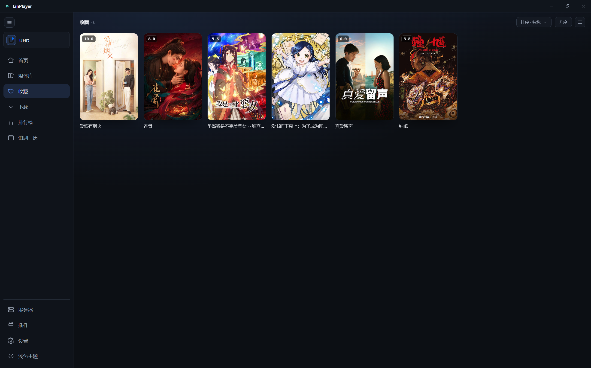 <b>收藏</b></td>
  </tr>
  <tr>
    <td>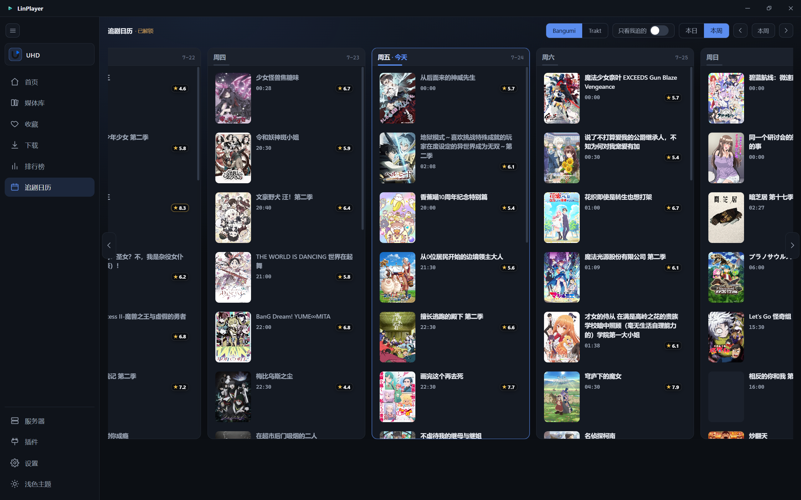 <b>追剧日历 · 本周</b></td>
    <td>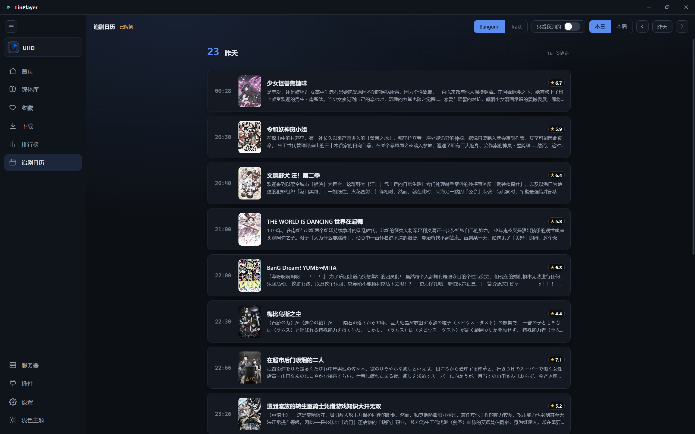 <b>追剧日历 · 本日</b></td>
  </tr>
  <tr>
    <td>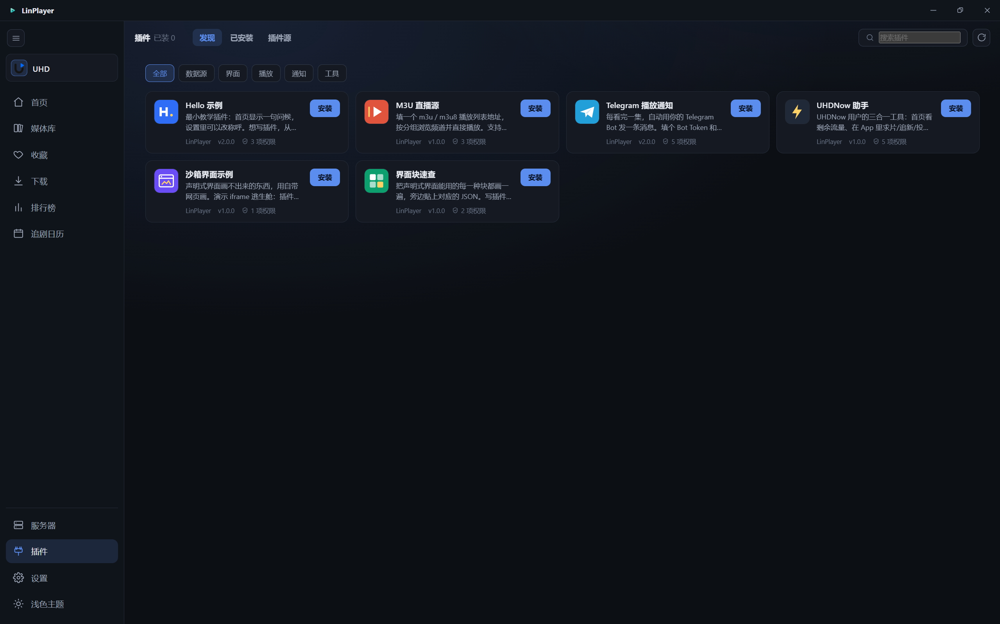 <b>插件</b></td>
    <td>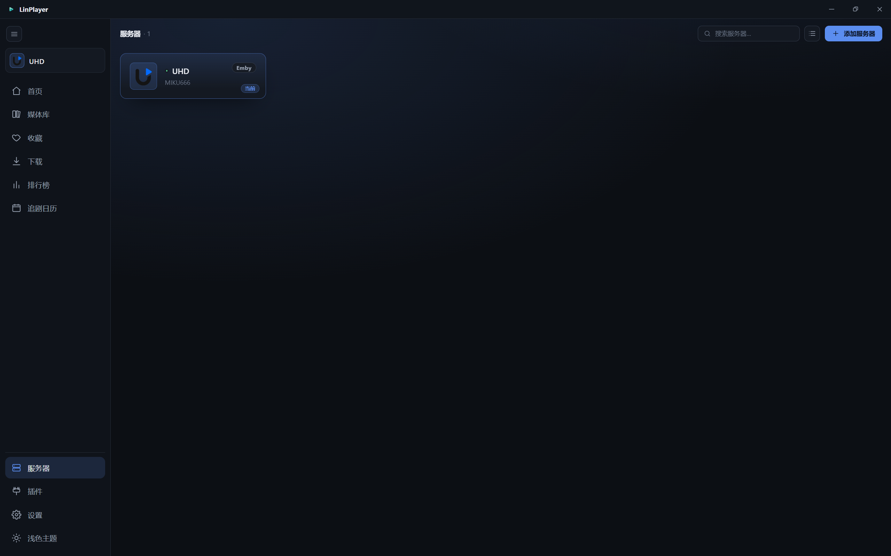 <b>服务器</b></td>
  </tr>
  <tr>
    <td>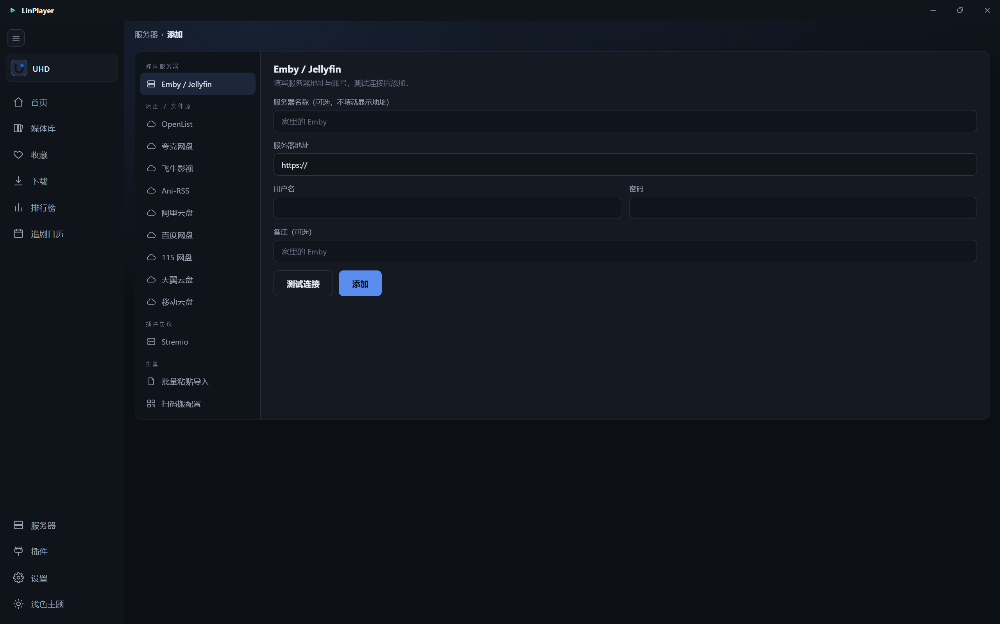 <b>添加服务器</b></td>
    <td>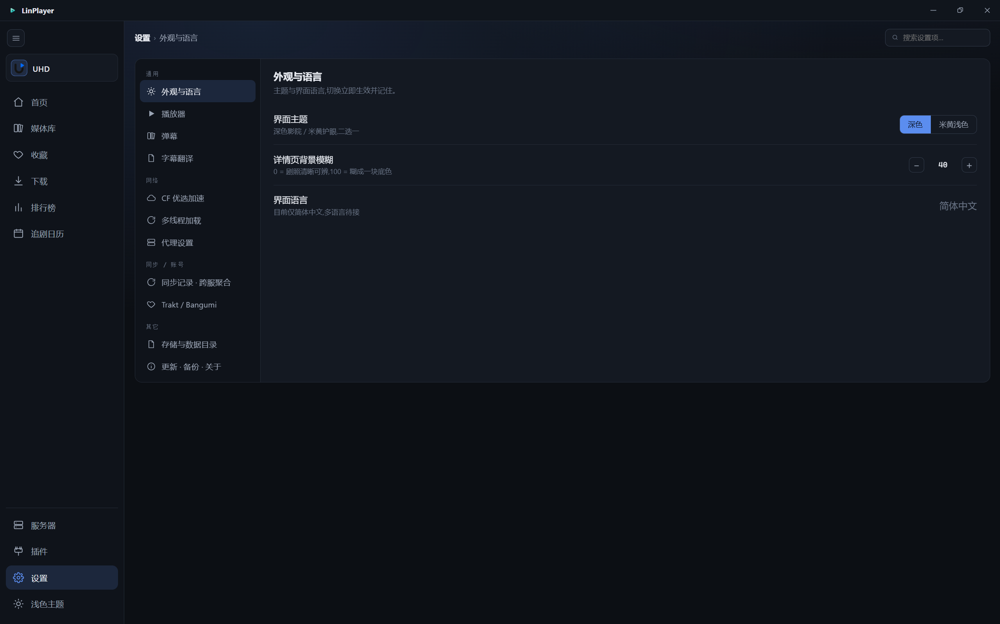 <b>设置</b></td>
  </tr>
  <tr>
    <td colspan="2" width="50%">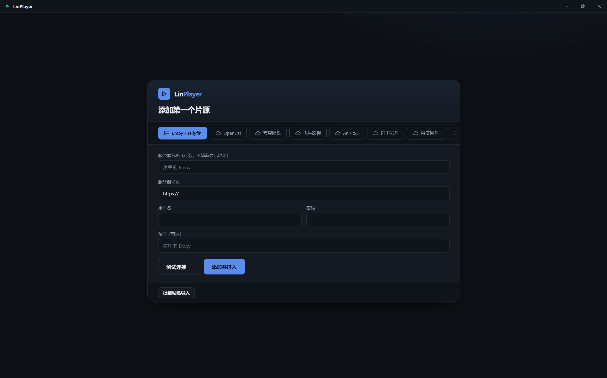 <b>首次登录</b></td>
  </tr>
</table>

### 移动端

<b>Flutter 版历史截图</b> —— 新安卓端 UI 重建中，重建完成后更换

 

> 截图内容来自 [**BAVA 服**](https://shop.mebimmer.de)。

<table>
  <tr>
    <td colspan="3"> <b>播放页</b></td>
  </tr>
  <tr>
    <td width="33%"> <b>首页</b></td>
    <td width="33%"> <b>剧集详情</b></td>
    <td width="33%"> <b>集详情</b></td>
  </tr>
  <tr>
    <td> <b>电影详情</b></td>
    <td> <b>排行榜</b></td>
    <td> <b>设置</b></td>
  </tr>
</table>

## 开发与技术

仓库结构、本地开发与构建、技术栈详见 **[开发文档](docs/DEVELOPMENT.md)**。

## 免责声明

### 关于内容与资源

- LinPlayer 是一款**纯本地播放器 / 第三方客户端**,自身**不提供、不存储、不托管、不分发任何影视资源**,也不内置任何内容源。
- 应用内展示与播放的所有媒体,均来自**用户自行添加的服务器(如 Emby)或用户自行配置的网络来源**,资源的来源、版权与合法性**由用户自行负责**。
- 请仅用于播放你**依法拥有或已获授权**的内容,并遵守你所在国家/地区的法律法规。因使用者不当使用而产生的任何纠纷、损失或法律责任,**由使用者自行承担**,与本项目及开发者无关。
- 本项目为**免费开源、非营利**软件,不以任何形式从内容传播中获利。如有版权方认为相关内容不妥,问题在于内容来源方,请联系对应的资源/服务器提供者。

### 关于匿名遥测与隐私

- **当前 Windows 版（Go 核心 + C#/Avalonia 壳）不含任何遥测或崩溃上报。** 原先集成的 Sentry
  随 2026-09-04 删除 Rust/Tauri 栈一并移除，`git grep -i sentry` 在 `core/`、`apps/`、`bindings/`
  下没有任何命中。
- 我们**绝不采集任何可识别你个人身份的信息**：不采集你的账号、密码、Cookie、Token、服务器地址、
  媒体库内容、观看记录或 IP；**不录屏、不追踪你的行为轨迹**。
- 将来若重新引入匿名崩溃上报，会在本节写明采集范围，并保证**绝不出售、共享或用于广告及任何商业用途**。

## 许可证

[LICENSE](LICENSE)

## 致谢

感谢以下开源项目、媒体服务与内核，LinPlayer 站在它们的肩膀上：

### 播放内核

- [mpv](https://github.com/mpv-player/mpv) / [libmpv](https://github.com/mpv-player/mpv) — 全格式播放核心
- [shinchiro mpv-winbuild](https://github.com/shinchiro/mpv-winbuild-cmake) — Windows 完整版 libmpv 预编译（含 PGS/SUP 解码器）
- [Anime4K](https://github.com/bloc97/Anime4K) — 动漫实时超分辨率 GLSL 着色器
- [mpv_PlayKit](https://github.com/hooke007/mpv_PlayKit) — 画质档位 shader 移植与文档
- [AMD FidelityFX (FSR / CAS)](https://github.com/GPUOpen-LibrariesAndSDKs/FidelityFX-SDK) — 放大与锐化着色器
- [NVIDIA Image Scaling](https://github.com/NVIDIAGameWorks/NVIDIAImageScaling) — NVScaler / NVSharpen 着色器

### UI 与框架

- [Go](https://go.dev) — 各端共用的业务核心（编译成 `lpcore` 动态库，经 C ABI 供各端调用）
- [.NET 10](https://dotnet.microsoft.com) / [Avalonia](https://avaloniaui.net) — Windows 外壳与 UI

### 服务与数据源

- [Emby](https://emby.media/) — 媒体服务器
- [弹弹play (DanDanPlay)](https://www.dandanplay.com/) — 弹幕与动漫排行榜数据
- [TMDB](https://www.themoviedb.org/) — 影视排行榜数据
- [Bangumi (bgm.tv)](https://bgm.tv/) — 番剧追番进度与收藏同步
- [Trakt](https://trakt.tv/) — 影视观看记录同步（Scrobble）
- [Ani-rss](https://github.com/wushuo894/ani-rss) — 番剧 RSS 订阅与自动下载

### Emby 服

感谢以下 Emby 服为 LinPlayer 提供界面演示与长期支持：

- [UHD MEDIA](https://www.uhdnow.com) — 桌面端截图内容来源
- [BAVA 服](https://shop.mebimmer.de) — 移动端截图内容来源

### 网络与代理

- [rustls](https://github.com/rustls/rustls) — TLS 实现（按 host 白名单放行自签名证书）
- [CloudflareSpeedTest](https://github.com/XIU2/CloudflareSpeedTest) — 优选 IP 本地反代的灵感来自 XIU2 大佬的这个项目

### 脚本与工具

- [QuickJS](https://bellard.org/quickjs/) — 插件脚本引擎

> 数据来源 TMDB 与弹弹play 的内容版权归各自所有；本项目仅作聚合展示，不存储或分发受版权保护的媒体。

## Star History

<!-- 自建实时图(oauth-proxy/functions/star/history.svg.js)。
     不用 star-history.com:它没命中缓存就现场去 GitHub 拉,超过自己 10 秒上限就回 500，
     README 里那张图「时不时看不了」就是这么来的（实测连 facebook/react 都 500）。 -->
<a href="https://github.com/zzzwannasleep/LinPlayer/stargazers">
 <picture>
   <source media="(prefers-color-scheme: dark)" srcset="https://291277.xyz/star/history.svg?theme=dark" />
   <source media="(prefers-color-scheme: light)" srcset="https://291277.xyz/star/history.svg" />
   
 </picture>
</a>

## 项目活跃度

## 赞助

感谢在 [爱发电](https://afdian.com/a/zzzwannasleep) 支持 LinPlayer 的各位（名单实时更新）：

  

## 加入频道

Telegram 频道 [**@MikudesuChannels**](https://t.me/MikudesuChannels) —— 版本发布、更新预告与讨论。
